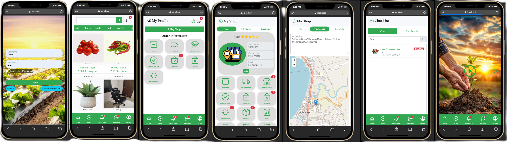
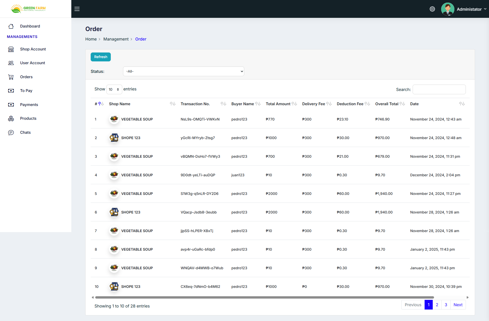

## 📸 Screenshots

LARAVEL MOBILE FARM TRADING E-COMMERCE

(Web & Mobile Application)

📄 Description

Laravel Mobile Farm Trading E-Commerce is a web and mobile application designed to connect farmers, sellers, and buyers through a centralized e-commerce platform. The system enables farm product trading while enhancing user engagement through a built-in community forum and discussion board.

The platform aims to support digital agriculture by simplifying product listing, ordering, and communication between stakeholders. It is built using Laravel and follows modern web development best practices, making it suitable for real-world deployment, academic projects, and portfolio demonstration.

🚀 Features
🛒 E-Commerce

Farm product listing and management

Product categories and pricing

Cart and checkout flow

Order and transaction management

Payment-ready architecture (extensible)

👥 User Management

User registration and authentication

Role-based access (Admin, Seller, Buyer)

Profile management

💬 Community Forum

Discussion boards for farmers and buyers

Post creation, replies, and moderation

Knowledge sharing and announcements

📱 Web & Mobile Ready

REST API support for mobile applications

Responsive web interface

Mobile-app friendly authentication (JWT / token-based)

🛠️ Tech Stack

Backend: Laravel

Frontend (Web): Blade / Bootstrap 5

Mobile: API-ready (for Flutter / React Native / Android / iOS)

Database: MySQL / SQL Server

Authentication: Laravel Auth / API Tokens

Server: Apache / Nginx / IIS

📂 Project Structure
├── app/
│   ├── Http/
│   │   ├── Controllers/
│   │   ├── Middleware/
│   │   └── Requests/
│   ├── Models/
│   └── Services/
├── database/
│   ├── migrations/
│   └── seeders/
├── routes/
│   ├── web.php
│   └── api.php
├── resources/
│   ├── views/
│   └── js/
├── public/
├── .env
├── composer.json
└── README.md

⚙️ Installation & Setup
1️⃣ Clone the repository
git clone https://github.com/your-username/laravel-mobile-farm-trading-ecommerce.git
cd laravel-mobile-farm-trading-ecommerce

2️⃣ Install dependencies
composer install

3️⃣ Environment configuration
cp .env.example .env
php artisan key:generate

Update database credentials in .env:

DB_CONNECTION=mysql
DB_HOST=127.0.0.1
DB_PORT=3306
DB_DATABASE=farm_trading_db
DB_USERNAME=root
DB_PASSWORD=

4️⃣ Run migrations
php artisan migrate

5️⃣ Run the application
php artisan serve

Access:

http://127.0.0.1:8000

🔐 User Roles

Admin – Full system access and moderation

Seller/Farmer – Product listing and order management

Buyer – Browse products, place orders, join discussions

🔗 API Support (Mobile App)

RESTful API endpoints

Token-based authentication

Designed for mobile app integration

Example:

/api/login
/api/products
/api/orders
/api/forum/posts

🧪 Testing
php artisan test

📈 Future Enhancements

Mobile app implementation (Flutter / React Native)

Online payment gateway integration

Real-time chat and notifications

Product reviews and ratings

Admin analytics dashboard

Clean Architecture / Domain-driven refactor

🤝 Contribution

Contributions are welcome!

Fork the repository

Create a new feature branch

Commit your changes

Submit a pull request

📄 License

This project is licensed under the MIT License.

👨‍💻 Author

Kee Ken
Laravel & ASP.NET Developer
📍 Philippines
